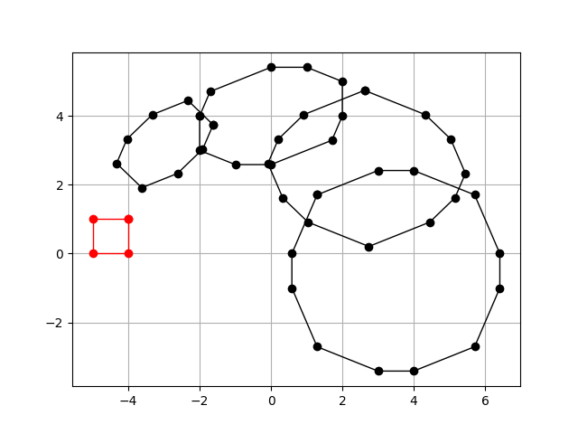
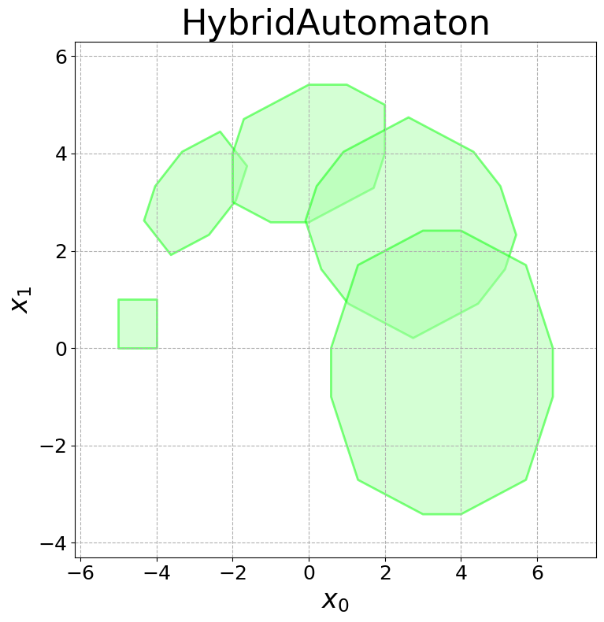
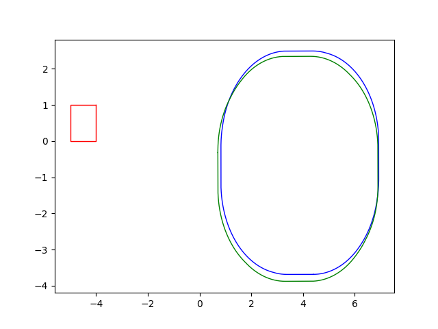

# Quick Zono Reach #

   

Quickzonoreach is a `python3` library for quick computations of discrete-time reach sets using zonotopes, aiming to be suitable for online computation. The system model is `x' = A_i x + B_i u`, where `A_i` and `B_i` can change at each step. The initial states are given as a box and each step can have its own box input constraints and time step.

## Important Functions ##

Important functions (all in `zono.py`):

* `get_zonotope_reachset()`: computes and returns the reach set, given lists for the parameters at each step.
* `Zonotope.verts()`: get an approximate 2-d projection of the zonotope.
* `Zonotope.plot()`: plots a 2-d projection of the zonotope with matplotlib.
* `Zonotope.maximize()`: optimize over the zonotope in a given direction, for quick safety checking without LP.

## Examples ##

Three examples are also provided:

* `code/example_plot.py`: Produce `quickzonoreach.png` (the plot at the top of the `README`) which matches Hylaa's output, `hylaa.png`, that can be produced by `hylaa_check.py` (you'll need Hylaa installed from https://github.com/stanleybak/hylaa).
* `code/example_compare.py`: Compares accuracy using `quick=True` (Euler approximation) method vs computing full matrix exponential. The `quick=True` mode is fairly accurate when the time step is small. This plot is provided below.
* `code/example_profile.py`: Measures runtime for various step sizes and dimensions to produce the tables shown below.

## Quick Matrix Exponential Mode ##

The `quick=True` paramter to `get_zonotope_reachset` can be used to approximate the matrix exponential by the first two terms of the series definition (`e^{At} = I + At`), rather than computing it with a library call to `expm`. This is slightly faster, and may be accurate enough especially when the time step is small. A plot showing the difference at the final time step (at time `pi`) for the noisy harmonic oscillator system is below:

  

## Profiling Runtimes ##

A rough gauge of performance can be computed with `example_profile.py`. Performance depends in the specific system, so it may vary from when you use the library. The script will produce the tables show below.

For these measurements, we used a replicated a noisey harmonic oscillator with two inputs at each time step. The time bound is `pi`, and we vary the number of dimensions and time steps. The measurements are in seconds, performed on my laptop (i5-5300U CPU at 2.3GHz).

### Exact Matrix Exponential, Saving All Zonotopes ###

Exact Save All | **8 steps** | **16 steps** | **32 steps** | **64 steps** | **128 steps** | **256 steps**
--- | --- | --- | --- | --- | --- | ---
**2 dims** | 0.07 | 0.1 | 0.2 | 0.4 | 0.9 | 1.6
**4 dims** | 0.07 | 0.1 | 0.2 | 0.5 | 0.9 | 1.8
**8 dims** | 0.08 | 0.1 | 0.3 | 0.5 | 1.0 | -
**16 dims** | 0.09 | 0.2 | 0.3 | 0.6 | 1.3 | -
**32 dims** | 0.1 | 0.2 | 0.5 | 0.9 | 2.0 | -
**64 dims** | 0.5 | 0.9 | 1.6 | - | - | -
**128 dims** | 1.1 | - | - | - | - | -

### Quick Matrix Exponential, Saving All Zonotopes ###

Quick Save All | **8 steps** | **16 steps** | **32 steps** | **64 steps** | **128 steps** | **256 steps** | **512 steps** | **1024 steps** | **2048 steps**
--- | --- | --- | --- | --- | --- | --- | --- | --- | ---
**2 dims** | 0.0007 | 0.001 | 0.002 | 0.005 | 0.02 | 0.08 | 0.1 | 0.7 | 2.2
**4 dims** | 0.0005 | 0.0005 | 0.001 | 0.002 | 0.007 | 0.02 | 0.1 | 0.6 | 2.3
**8 dims** | 0.0005 | 0.0006 | 0.001 | 0.003 | 0.008 | 0.04 | 0.1 | 0.7 | 2.5
**16 dims** | 0.0006 | 0.0009 | 0.003 | 0.003 | 0.009 | 0.04 | 0.2 | 1.4 | -
**32 dims** | 0.002 | 0.003 | 0.004 | 0.01 | 0.03 | 0.07 | 0.4 | 2.0 | -
**64 dims** | 0.005 | 0.006 | 0.009 | 0.02 | 0.05 | 0.2 | 0.7 | 2.6 | -
**128 dims** | 0.02 | 0.02 | 0.03 | 0.06 | 0.1 | 0.5 | 1.6 | - | -
**256 dims** | 0.07 | 0.1 | 0.1 | 0.3 | 0.6 | 1.6 | - | - | -
**512 dims** | 0.3 | 0.5 | 0.7 | 1.3 | - | - | - | - | -
**1024 dims** | 1.4 | - | - | - | - | - | - | - | -

### Quick Matrix Exponential, Saving Only the Last Zonotope ###

Which zonotopes are saved can be controlled with the `save_list` parameter to `get_zonotope_reachset`. If you're doing many steps or working in high dimensions, saving copies at every step can sometimes slow things down.

Quick Save Last | **8 steps** | **16 steps** | **32 steps** | **64 steps** | **128 steps** | **256 steps** | **512 steps** | **1024 steps** | **2048 steps** | **4096 steps** | **8192 steps** | **16384 steps**
--- | --- | --- | --- | --- | --- | --- | --- | --- | --- | --- | --- | ---
**2 dims** | 0.0006 | 0.0007 | 0.001 | 0.002 | 0.01 | 0.02 | 0.03 | 0.04 | 0.07 | 0.2 | 0.5 | 1.7
**4 dims** | 0.0004 | 0.0004 | 0.0006 | 0.001 | 0.002 | 0.005 | 0.01 | 0.03 | 0.08 | 0.3 | 0.9 | 5.8
**8 dims** | 0.001 | 0.001 | 0.002 | 0.003 | 0.006 | 0.02 | 0.04 | 0.08 | 0.1 | 0.8 | 3.4 | -
**16 dims** | 0.001 | 0.001 | 0.002 | 0.02 | 0.007 | 0.02 | 0.07 | 0.1 | 0.5 | 1.9 | - | -
**32 dims** | 0.002 | 0.01 | 0.003 | 0.01 | 0.03 | 0.05 | 0.2 | 0.3 | 1.3 | - | - | -
**64 dims** | 0.005 | 0.006 | 0.008 | 0.02 | 0.05 | 0.1 | 0.3 | 0.9 | 3.5 | - | - | -
**128 dims** | 0.04 | 0.04 | 0.04 | 0.06 | 0.1 | 0.3 | 0.8 | 2.9 | - | - | - | -
**256 dims** | 0.07 | 0.1 | 0.1 | 0.2 | 0.5 | 1.4 | - | - | - | - | - | -
**512 dims** | 0.3 | 0.4 | 0.6 | 1.2 | - | - | - | - | - | - | - | -
**1024 dims** | 1.2 | - | - | - | - | - | - | - | - | - | - | -

## Ideas for More Speed ##

If using `quick` and only saving some of the zonotopes is still too slow, make sure you have a good version of BLAS installed like OpenBlas (matrix dot product in `numpy` is an important operation for speed). It may be possible to use 32-bit floats instead of 64 bit.

Also, the library is currently single-threaded, so using multiple cores or GPUs for computation could increase speed more, although this would need code modification.
